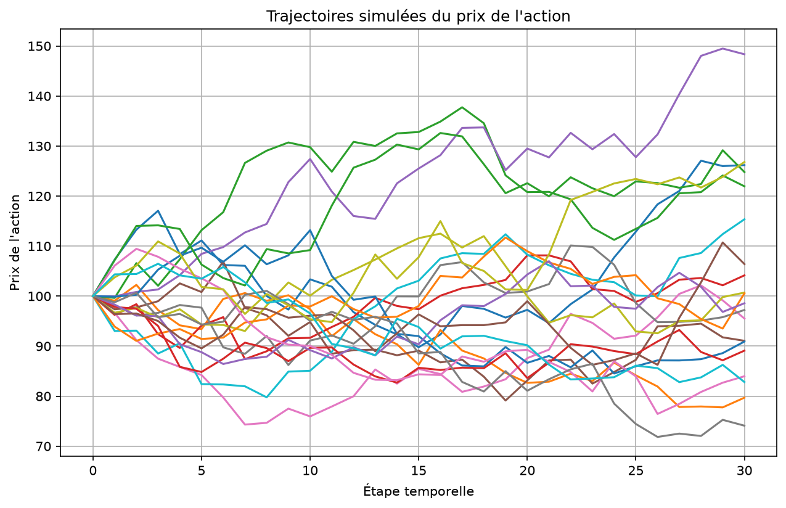
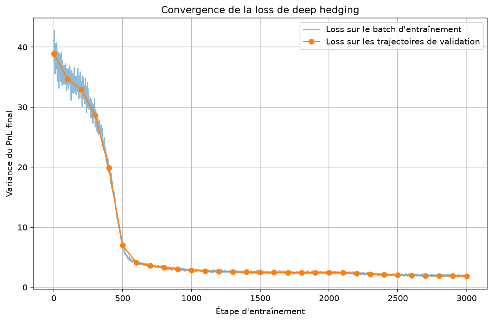
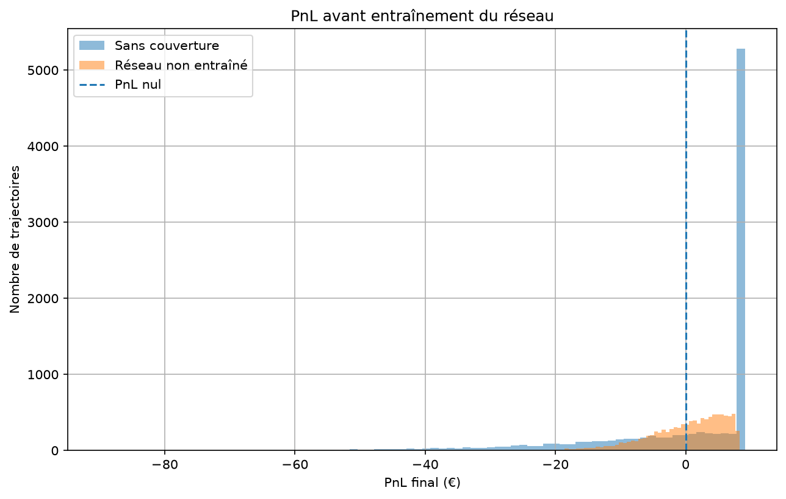
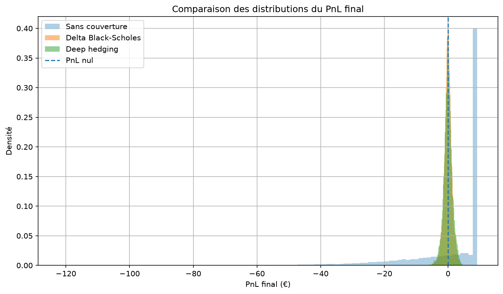

# Deep Hedging

Educational project on hedging a European option using a neural network trained with PyTorch.

The objective is to compare two hedging methods:

* classical Black-Scholes delta hedging;
* a deep hedging strategy learned by a neural network.

The network does not directly learn the Black-Scholes delta formula. It only learns how to choose a hedging position in order to reduce the risk of the final PnL.

---

## Project Objective

We consider a bank that has sold a European call option.

At maturity, it must pay the option holder:

```text
payoff = max(S_T - K, 0)
```

where:

```text
S_T = stock price at maturity
K   = option strike
```

If the stock price increases significantly, the payoff can become large.

The bank therefore seeks to reduce this risk by regularly buying or selling shares of the underlying stock.

The problem is to determine:

```text
How many shares should be held
at each date to hedge the call?
```

Two methods are studied:

```text
Black-Scholes
→ uses an analytical formula to compute the delta

Deep Hedging
→ uses a neural network trained on simulated paths
```

---

# Project Structure

```text
deep-hedging/
├── figures/
│   ├── gbm_paths.png
│   ├── untrained_network_pnl.png
│   ├── training_loss.png
│   └── pnl_comparison.png
│
├── models/
│   └── hedging_network.pt
│
├── src/
│   ├── __init__.py
│   ├── black_scholes.py
│   ├── delta_hedging.py
│   ├── gbm.py
│   ├── hedging.py
│   ├── hedging_network.py
│   └── losses.py
│
├── torch_check.py
├── gbm_demo.py
├── network_demo.py
├── hedging_pnl_demo.py
├── train_network.py
├── compare_hedging.py
├── requirements.txt
├── .gitignore
└── README.md
```

The `hedging_network.pt` file contains the learned parameters of the neural network. It can be excluded from the GitHub repository if trained models are ignored in `.gitignore`.

---

# Installation

Create a virtual environment:

```powershell
python -m venv .venv
```

On PowerShell, it may be necessary to temporarily allow script execution:

```powershell
Set-ExecutionPolicy -Scope Process -ExecutionPolicy RemoteSigned
```

Then activate the environment:

```powershell
.\.venv\Scripts\Activate.ps1
```

Install the dependencies:

```powershell
python -m pip install -r requirements.txt
```

The main libraries used are:

```text
PyTorch
NumPy
Matplotlib
SciPy
```

---

# Execution Order

The different scripts can be executed in the following order:

```powershell
python torch_check.py
python gbm_demo.py
python network_demo.py
python hedging_pnl_demo.py
python train_network.py
python compare_hedging.py
```

---

# 1. Stock Price Simulation

Stock price paths are simulated using a geometric Brownian motion.

The discretization used is:

```text
S_(t+dt)
=
S_t
×
exp(
    (r - 0.5 × sigma²) × dt
    +
    sigma × sqrt(dt) × Z
)
```

with:

```text
S_t   = current stock price
r     = risk-free rate
sigma = volatility
dt    = time-step length
Z     = standard normal random variable N(0,1)
```

The corresponding code is located in:

```text
src/gbm.py
```

PyTorch makes it possible to simulate several thousand paths simultaneously.

For example, a tensor containing:

```text
5000 paths
31 dates
```

has the shape:

```text
torch.Size([5000, 31])
```

Each row corresponds to one path and each column to one date.

The simulated path figure is saved in:

```text
figures/gbm_paths.png
```



---

# 2. Black-Scholes Call Price

The bank initially sells the call and receives the option premium.

The theoretical call price is calculated using the Black-Scholes formula in:

```text
src/black_scholes.py
```

Under the risk-neutral probability measure:

```text
call price today
=
discounted risk-neutral expected payoff
```

In other words:

```text
call price
=
exp(-rT)
×
risk-neutral expectation of the payoff
```

The paths used in the project are therefore simulated with a drift equal to the risk-free rate.

---

# 3. Hedging Principle

A bank that has sold a call loses money when the value of the call increases.

To reduce this risk, it buys shares of the underlying stock.

For example:

```text
Call delta = 0.60

The stock rises by €1
→ the call increases by approximately €0.60

The bank owns 0.60 shares
→ the shares gain approximately €0.60
```

The two movements partially offset each other.

However, the position must be regularly rebalanced because the delta changes with:

```text
the stock price
the remaining time
the volatility
the strike
```

---

# 4. Hedging Portfolio

The bank's portfolio contains:

```text
a cash account
+
a stock position
-
the short call
```

When the bank changes its hedge:

```text
number of shares purchased
=
new position - previous position
```

The rebalancing cost is:

```text
cost
=
number of shares purchased × current stock price
```

The cash account is updated at each date.

If it is positive, it earns interest.

If it is negative, it represents borrowing and generates an interest cost.

---

# 5. Final PnL

The PnL used during training is calculated only at maturity.

During each path, the program updates:

```text
the stock position
the cash account
the purchases and sales
the interest
```

At maturity:

```text
final hedging wealth
=
final cash
+
final position × terminal stock price
```

The call payoff must then be paid:

```text
final PnL
=
final hedging wealth
-
call payoff
```

Each path therefore produces one final PnL.

With:

```text
10,000 paths
```

we obtain:

```text
10,000 final PnL values
```

---

# 6. Neural Network

The neural network is defined in:

```text
src/hedging_network.py
```

It receives three pieces of information:

```text
1. stock price / strike
2. proportion of time remaining
3. current hedging position
```

The first variable corresponds to moneyness:

```text
moneyness = S / K
```

Examples:

```text
S / K < 1
→ stock price below the strike

S / K = 1
→ stock price at the strike

S / K > 1
→ stock price above the strike
```

The network produces a single output:

```text
new hedging position
```

A sigmoid function constrains this position between 0 and 1.

---

# 7. Neural Network Architecture

The architecture used is:

```text
3 inputs
    ↓
Linear: 3 → 16
    ↓
ReLU
    ↓
Linear: 16 → 16
    ↓
ReLU
    ↓
Linear: 16 → 1
    ↓
Sigmoid
    ↓
hedging position
```

The network contains 353 trainable parameters.

These parameters consist of the weights and biases of the different layers.

At the beginning of training, they are automatically initialized.

---

# 8. ReLU Function

The ReLU function is defined as:

```text
ReLU(x) = max(0, x)
```

Examples:

```text
ReLU(-2) = 0
ReLU(0)  = 0
ReLU(3)  = 3
```

It introduces non-linearity into the network.

Without a non-linear activation function, several successive linear layers would remain equivalent to a single linear transformation.

---

# 9. Sigmoid Function

The final layer uses a sigmoid function.

It transforms any input value into a number between 0 and 1.

```text
very negative input
→ output close to 0

input close to 0
→ output close to 0.5

very positive input
→ output close to 1
```

The output can therefore be directly interpreted as the number of shares to hold.

---

# 10. Deep Hedging

At each date, the network receives:

```text
[S_t / K, time remaining, current position]
```

and returns:

```text
new position
```

The same network is used at every date.

There is therefore not a different network for each time step.

The process is:

```text
current state
      ↓
network
      ↓
new position
      ↓
buy or sell shares
      ↓
update cash account
      ↓
next date
```

This process is repeated until maturity.

---

# 11. Loss Function

The network is trained to reduce the dispersion of the final PnL.

The loss used is the variance of the PnL:

```text
mean PnL
=
average of the PnL values

centered PnL
=
PnL - mean PnL

loss
=
average of squared centered PnL values
```

A low variance means that the portfolio outcomes are more concentrated.

The mean PnL is also monitored to ensure that a low variance does not hide a significant bias.

The loss function is located in:

```text
src/losses.py
```

---

# 12. Gradient Descent

Training follows the process:

```text
network weights
       ↓
hedging positions
       ↓
final PnL
       ↓
loss
       ↓
gradient computation
       ↓
weight updates
```

The core PyTorch training loop is:

```python
optimizer.zero_grad()

loss.backward()

optimizer.step()
```

## `zero_grad`

Clears the gradients computed during the previous training step.

## `backward`

Performs backpropagation.

PyTorch automatically computes the influence of each network parameter on the loss.

## `step`

The optimizer updates the parameters using the computed gradients.

---

# 13. Adam Optimizer

The project uses Adam:

```text
learning rate = 0.001
```

Adam is an optimization method based on gradient descent.

It adapts parameter updates using the recent history of the gradients.

The general principle remains:

```text
parameter
=
parameter
-
correction determined from the gradient
```

---

# 14. Training

The network is trained using newly simulated scenarios at each iteration.

One configuration used is:

```text
batch size = 2048 paths
number of iterations = 3000
```

This represents more than six million paths presented to the network during training.

They are not all stored simultaneously:

```text
generate one batch
→ train
→ discard the batch
→ generate a new batch
```

The convergence figure is saved in:

```text
figures/training_loss.png
```



The goal is to observe a decrease and then stabilization of the validation loss.

---

# 15. Training, Validation and Test

Three types of simulated paths are distinguished.

## Training

Training paths are used to:

```text
compute the loss
compute the gradients
update the parameters
```

## Validation

A fixed set of paths is used to monitor performance during training.

These paths are never directly used to update the weights.

They make it possible to verify that the network is genuinely improving its ability to generalize.

## Test

A third set of paths is used only for the final comparison.

```text
train
→ learning

validation
→ monitoring during learning

test
→ final evaluation
```

---

# 16. Saving the Network

After training, the learned parameters are saved in:

```text
models/hedging_network.pt
```

The checkpoint contains, among other things:

```text
the network weights and biases
the size of the layers
the model parameters
some validation statistics
```

It can later be loaded without retraining the network.

---

# 17. Untrained Network

Before training, the network parameters are essentially random.

The positions produced by the network therefore do not yet have meaningful financial interpretation.

The project compares:

```text
PnL without hedging
PnL with an untrained network
```

in:

```text
figures/untrained_network_pnl.png
```



This step illustrates that the architecture alone is not sufficient: the network must learn from the loss function.

---

# 18. Black-Scholes Delta Hedging

A classical hedging strategy is implemented in:

```text
src/delta_hedging.py
```

The Black-Scholes delta of a call is:

```text
delta = N(d1)
```

where `N` represents the cumulative distribution function of the standard normal distribution.

At each date:

```text
1. the current stock price is observed
2. the Black-Scholes delta is recomputed
3. the stock position is adjusted
4. the cash account is updated
```

The delta directly gives the number of shares to hold per short call.

---

# 19. Why Is Delta Hedging Not Perfect?

In Black-Scholes theory, perfect replication assumes continuously rebalanced hedging.

In this project, only 30 rebalancing dates are used over one year.

```text
theoretical hedging:
continuous rebalancing

simulation:
30 rebalancing dates
```

The stock price can move between two dates while the hedging position remains unchanged.

This creates a hedging error.

The final PnL is therefore not exactly zero, even for Black-Scholes delta hedging.

---

# 20. Final Comparison

The script:

```text
compare_hedging.py
```

compares three strategies using exactly the same test paths:

```text
1. no hedging
2. Black-Scholes delta hedging
3. deep hedging
```

Using the same paths is essential to make the comparison fair.

The final figure is saved in:

```text
figures/pnl_comparison.png
```



---

# 21. Performance Metrics

Several metrics are used to compare the PnL distributions.

## Mean PnL

```text
mean PnL
=
average of the final PnL values
```

A mean PnL close to zero is consistent with correct risk-neutral pricing.

---

## Standard Deviation

The standard deviation measures the dispersion of PnL values around their mean.

```text
low standard deviation
→ more concentrated outcomes
→ lower hedging risk
```

---

## Variance

Variance is the square of the standard deviation.

```text
variance
=
average squared deviation from the mean PnL
```

It is also the loss function used during training.

---

## RMSE

RMSE measures the average distance of the PnL from zero.

```text
RMSE
=
square root of the average squared PnL
```

Unlike variance, RMSE also penalizes a mean PnL that is far from zero.

---

# 22. Value at Risk

VaR is used to study adverse scenarios.

For a 95% VaR, the 5th percentile of the PnL distribution is considered.

Example:

```text
95% VaR = -€2.50
```

means that approximately 5% of the scenarios produce a PnL lower than or equal to approximately `-€2.50`.

---

# 23. CVaR

CVaR directly studies the left tail of the distribution.

It corresponds to the average PnL among the scenarios beyond the VaR threshold.

```text
95% CVaR
=
average PnL among the worst 5% of scenarios
```

Example:

```text
95% VaR  = -€2.50
95% CVaR = -€3.40
```

This means that among the worst 5% of scenarios, the average loss is approximately €3.40.

With our PnL convention:

```text
CVaR closer to zero
→ better result

very negative CVaR
→ larger extreme losses
```

CVaR therefore provides information about extreme risk that variance alone does not fully capture.

---

# 24. Main Result

The first important result is that:

```text
no hedging
→ highly dispersed PnL
```

whereas:

```text
Black-Scholes delta hedging
→ much lower dispersion
```

This quantitatively demonstrates the value of dynamic hedging.

After sufficiently long training, the neural network also learns to significantly reduce the dispersion of the PnL.

Its strategy approaches the Black-Scholes hedge without being directly given the delta formula.

The network learns only from:

```text
the simulated paths
the positions it chooses
the final PnL
the loss function
```

---

# 25. Why Does the Network Not Necessarily Beat Black-Scholes?

In this project, the paths are simulated exactly under the Black-Scholes assumptions:

```text
geometric Brownian motion
constant volatility
constant interest rate
no transaction costs
simplified market
```

Black-Scholes already provides an analytical solution that is particularly well suited to this environment.

There is therefore no reason to assume that a neural network should outperform it.

The interesting result is instead:

```text
the network learns a strategy close
to the analytical solution
without explicitly knowing that solution
```

---

# 26. When Does Deep Hedging Become More Interesting?

Deep hedging becomes more useful when the problem becomes too complex to have a simple analytical solution.

For example:

```text
transaction costs
position constraints
limited liquidity
stochastic volatility
multiple assets
asymmetric risk functions
complex financial instruments
```

In these situations, a hedging policy can be learned directly from an objective function.

---

# 27. Project Limitations

This project is an introduction to deep hedging.

Several assumptions are simplified.

## Black-Scholes Model

The paths are generated using a geometric Brownian motion.

In real markets:

```text
volatility is not constant
returns are not perfectly log-normal
jumps may occur
parameters change over time
```

---

## No Transaction Costs

Buying and selling shares is assumed to be costless.

In reality, frequent rebalancing generates transaction costs.

Transaction costs are precisely one of the situations in which deep hedging can become particularly interesting.

---

## Perfect Liquidity

The model assumes that any quantity of shares can be bought or sold instantly at the observed price.

There is no slippage or market impact.

---

## Same Borrowing and Lending Rate

Positive cash balances and debt are assumed to earn or pay the same risk-free rate.

This is a simplifying assumption.

---

## Single Option

The project only considers:

```text
one European call
on one underlying asset
```

Real portfolios may contain many instruments and several risk factors.

---

## Simple Architecture

The neural network contains only:

```text
two hidden layers
16 neurons per layer
```

The objective is educational rather than to search for an optimal architecture.

---

## Loss Function

The network mainly minimizes the variance of the PnL.

Other objectives could be used:

```text
CVaR
exponential utility
asymmetric losses
regulatory constraints
```

These could produce different hedging policies.

---

# 28. Possible Extensions

Several natural extensions are possible:

```text
add transaction costs
train directly on CVaR
use a Heston model
add position constraints
test different rebalancing frequencies
compare different neural network architectures
study different maturities
study different strikes
add multiple assets
test the model on market data
```

---

# 29. Skills Developed

This project provides practice with:

```text
Python
PyTorch
tensors
vectorization
neural networks
linear layers
ReLU
sigmoid
forward pass
backpropagation
autograd
gradient descent
Adam optimizer
training / validation / test
Monte Carlo simulation
geometric Brownian motion
Black-Scholes pricing
delta hedging
hedging portfolio management
PnL
variance
RMSE
VaR
CVaR
distribution analysis
Git
GitHub
```

---

# 30. Conclusion

This project shows how a neural network can learn a dynamic hedging strategy from a financial objective.

The network is not directly given the Black-Scholes delta.

It observes:

```text
the relative stock price
the remaining time
the current position
```

and chooses a new position.

Training relies only on the final PnL:

```text
positions
→ final portfolio
→ PnL
→ loss
→ gradients
→ improved weights
```

In an environment constructed according to Black-Scholes assumptions, the analytical hedge naturally provides a very strong benchmark.

After training, the neural network nevertheless manages to produce a hedge close to this reference.

The project therefore provides a simple introduction to deep hedging and to the use of deep learning for quantitative finance problems.

---

# Disclaimer

This project is for educational purposes only.

It does not constitute financial advice or a strategy intended for direct use in real financial markets.

